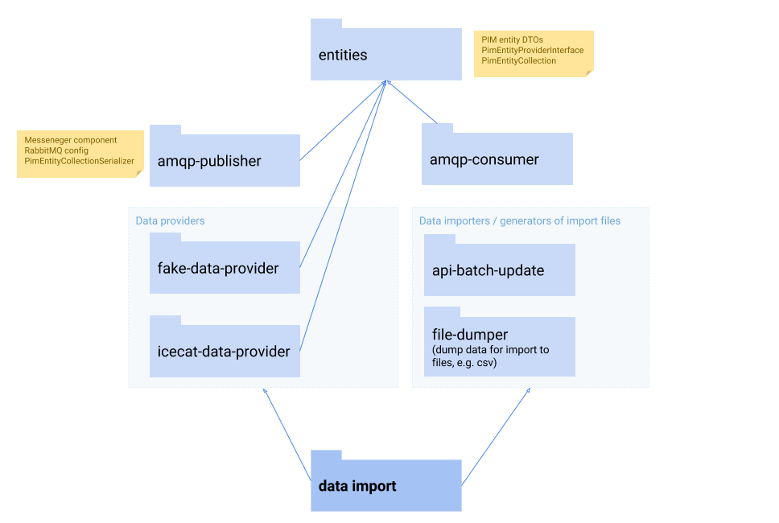
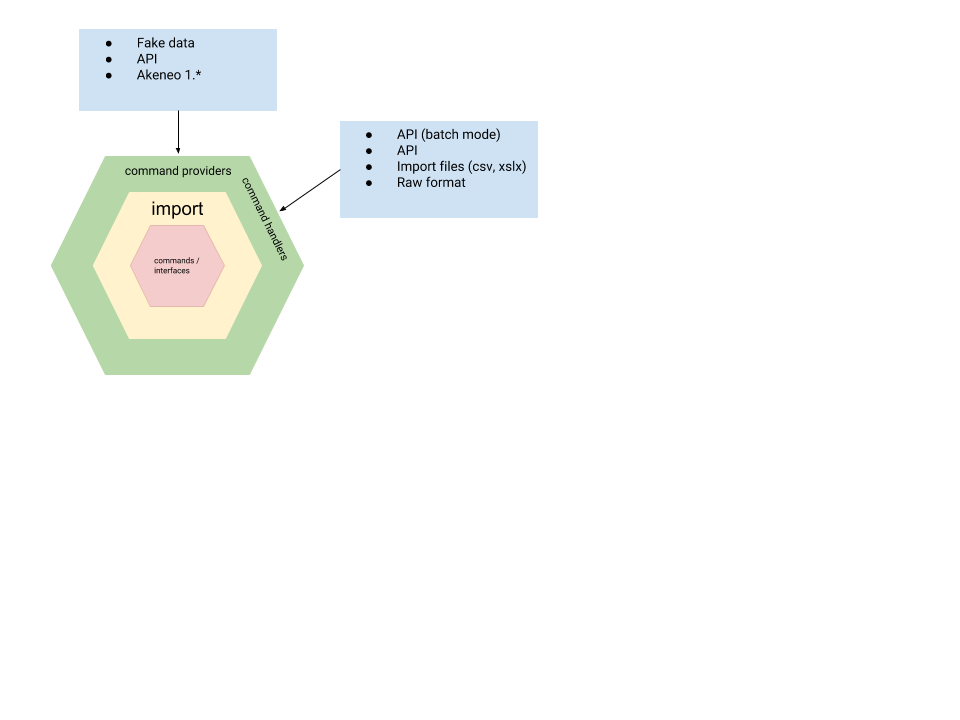

# Akeneo Data Import (in progress)

Application for data import to Akeneo PIM.

## Use cases

1. Import from external systems (legacy PIM or regular data provider)
2. Import from old versions (replacement for bad working Trasporteo)
3. Data generation (for tests purposes)
4. Batch data manipulations (e.g. if Akeneo code is not accessible)

## Package diagram

## Architecture

